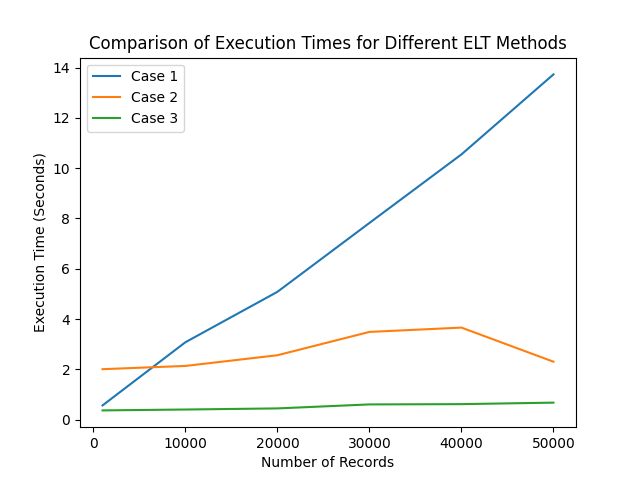

# ETL Methods Performance Comparison

This repository contains Python code for comparing the performance of three different ETL methods for processing CSV files. The three methods are as follows:

1. **Case 1**: Records are taken one by one from the CSV file, and ETL (Extract, Transform, Load) process is applied one by one to each record.
2. **Case 2**: The CSV file is exported to a SQLite database file, and ETL process is applied to the database file. The transformed data is then converted back to CSV.
3. **Case 3**: An extension of Case 2, where the database file is split into various files each having a different number of records, and the ETL process is implemented using multithreading with the pipelining concept.

## Dependencies

The code requires the following libraries:

- `csv`
- `sqlite3`
- `time`
- `os`
- `multiprocessing`
- `matplotlib`

## Usage

The code takes as input a set of CSV files with different numbers of records. The performance of each ETL method is tested on each CSV file, and the execution times are plotted using matplotlib.

To run the code, simply execute the `main.py` file in the command line:

```bash
python main.py
```

## Results

The results of the performance comparison are plotted using matplotlib. The x-axis represents the number of records in the CSV file, and the y-axis represents the execution time in seconds.

The results show that Case 1 is the slowest method for processing CSV files, as it takes a significantly longer time to process large files. Case 2 and Case 3 have similar execution times, but Case 3 has a slight advantage in terms of performance.



## Conclusion

In conclusion, the results suggest that using a database file and implementing multithreading with the pipelining concept can significantly improve the performance of ETL processes for processing large CSV files.